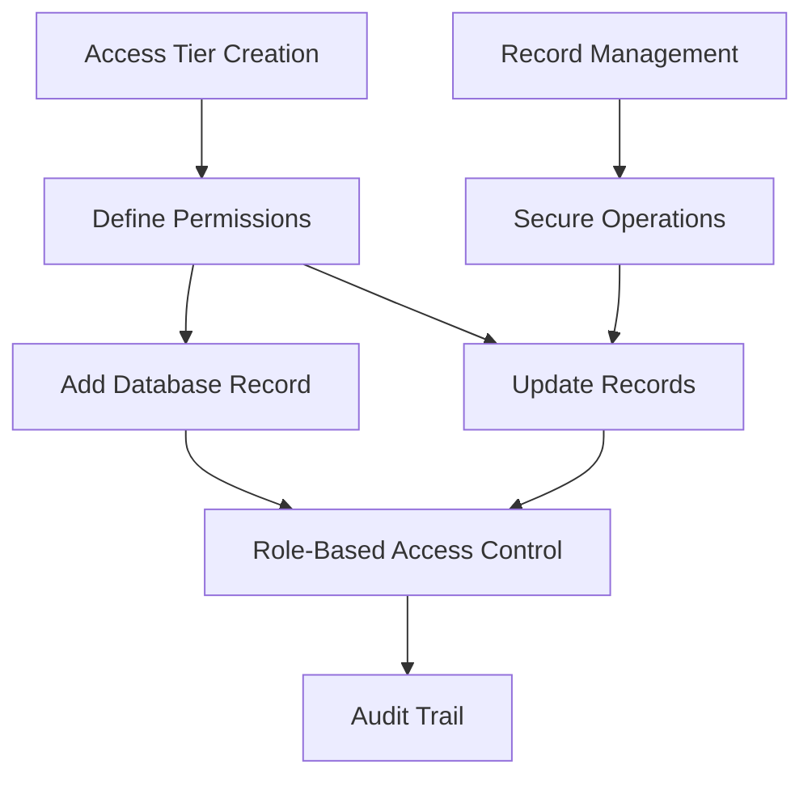

# 🔐 Protected Testnet Database

A decentralized, secure database management system built on Stacks blockchain, designed for handling sensitive testnet information with robust access control.

## Overview

Protected Testnet Database combines blockchain technology with advanced access management to create a transparent, secure data storage solution. The platform provides:

- Immutable record storage
- Role-based access control
- Granular permission management
- Transparent audit trails
- Decentralized database operations

## Architecture

The Protected Testnet Database is built around a core smart contract that manages database records, access tiers, and secure data operations.



### Core Components

1. **Access Control**: Manages roles and permissions
2. **Record Management**: Handles secure data storage and retrieval
3. **Audit Tracking**: Provides transparent operation logs
4. **Security Mechanisms**: Implements fine-grained access restrictions

## Contract Documentation

### testnet-database-core.clar

The main contract handling all core functionality of the Protected Testnet Database.

#### Key Features

- Access tier creation and management
- Secure record addition and modification
- Role-based access control
- Immutable record tracking
- Comprehensive error handling

#### Access Control

- Administrators can create and manage access tiers
- Users are restricted by predefined permission levels
- All operations are transparently logged

## Getting Started

### Prerequisites

- Clarinet
- Stacks wallet for interaction
- Web3 development environment

### Installation

1. Clone the repository
2. Install dependencies with Clarinet
3. Deploy contracts to the Stacks network

### Basic Usage

```clarity
;; Create an access tier
(contract-call? .testnet-database-core create-access-tier 
    "Admin Tier" true true true)

;; Add a database record
(contract-call? .testnet-database-core add-record 
    "Sensitive testnet configuration" u1)

;; Update a record
(contract-call? .testnet-database-core update-record 
    u1 "Updated configuration data")
```

## Function Reference

### Public Functions

#### `create-access-tier`
```clarity
(define-public (create-access-tier 
    (name (string-utf8 50)) 
    (read-access bool)
    (write-access bool)
    (delete-access bool)))
```
Creates a new access tier with specified permissions.

#### `add-record`
```clarity
(define-public (add-record 
    (data (string-utf8 500)) 
    (access-tier uint)))
```
Adds a new record to the database with specified access tier.

#### `update-record`
```clarity
(define-public (update-record 
    (record-id uint) 
    (new-data (string-utf8 500))))
```
Updates an existing database record.

#### `delete-record`
```clarity
(define-public (delete-record (record-id uint)))
```
Deletes a specific database record.

### Read-Only Functions

#### `get-record`
```clarity
(define-read-only (get-record (record-id uint)))
```
Retrieves details of a specific record.

#### `get-access-tier`
```clarity
(define-read-only (get-access-tier (tier-id uint)))
```
Retrieves details of a specific access tier.

## Development

### Testing

Run tests using Clarinet:

```bash
clarinet test
```

### Local Development

1. Start a local Clarinet console:
```bash
clarinet console
```

2. Deploy contracts:
```bash
clarinet deploy
```

## Security Considerations

### Limitations

- Record data limited to 500 characters
- Access tier permissions are binary
- Record modifications tracked but not reversible

### Best Practices

1. Create minimal, specific access tiers
2. Regularly audit access tier configurations
3. Validate data before submission
4. Use the most restrictive permissions possible
5. Monitor and log all database operations

### Data Validation

- Access tier names must be unique
- Record data must not exceed length limits
- Permissions are strictly controlled
- All operations require explicit authorization